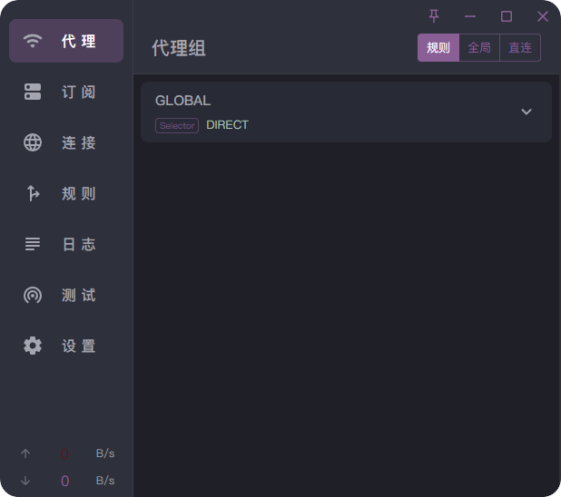
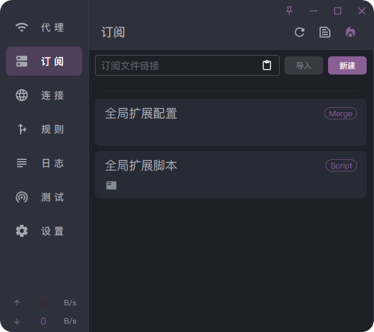
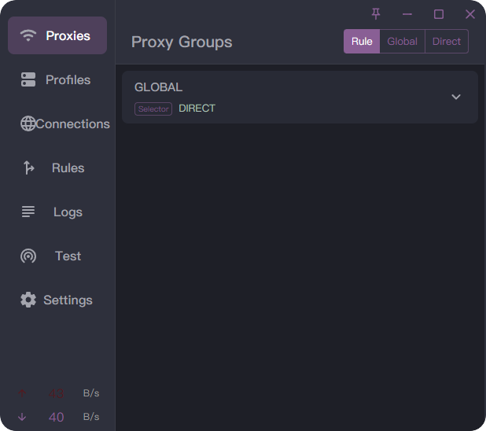
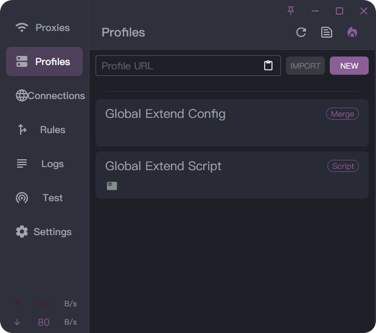
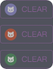

<h1 align="center">
  
  <br>
  <a href="https://github.com/clash-verge-rev/clash-verge-rev">Clash Verge rev</a> theme scheme
  <br>
</h1>

    

## 1.Icon

<table>
<tr>
 <td>png</td>
 <td align="center"></td>
 <td align="center"></td>
 <td align="center"></td>
</tr>
<tr>
 <td>ico</td>
 <td align="center"></td>
 <td align="center"></td>
 <td align="center"></td>
</tr>
</table>

## 2.Color scheme

| Color Name ✅         | 配色名 ✅     | Color hex    |
|:---------------------:|:-------------:|:------------:|
| Primary Color         | 主要顏色       | #8D5A97      |
| Secondary Color       | 次要顏色       | #53131E      |
| Primary Text          | 文本主要顏色    | #A4A5AE      |
| Secondary Text        | 文本次要顏色    | #B0C7BD      |
| Info Color            | 信息顏色       | #B8EBD0      |
| Warning Color         | 警告顏色       | #EE9B00      |
| Error Color           | 錯誤顏色       | #9B2226      |
| Success Color         | 成功顏色       | #38B000      |
| Font Family           | 字體系列       | Ping Fang    |

## 3.Css injection

```css
.layout__left .the-logo {
    visibility: hidden !important;
}

.linux.layout .layout__left .the-logo, .windows.layout .layout__left .the-logo, .unknown.layout .layout__left .the-logo {
    flex: 1 0 58px;
    margin-top: -70px;
    margin-left: 10px;
    padding: 30px 20px 26px 10px;
}

.layout__left {
    flex: 1 0 147px;
    display: flex;
    height: 100%;
    width: 100%;
    padding: 0 0 0px;
    flex-direction: column;
    align-self: stretch;
    box-sizing: border-box;
    user-select: none;
    -webkit-user-select: none;
    -moz-user-select: none;
    -ms-user-select: none;
    overflow: hidden;
    border-right: 1px solid var(--divider-color);
}

.css-79rra8 {
    display: flex;
    -webkit-box-pack: start;
    justify-content: flex-start;
    -webkit-box-align: center;
    align-items: center;
    position: relative;
    text-decoration: none;
    width: 100%;
    box-sizing: border-box;
    text-align: left;
    max-width: 250px;
    margin-left: auto;
    margin-right: auto;
    padding: 2px 0px;
}
```
